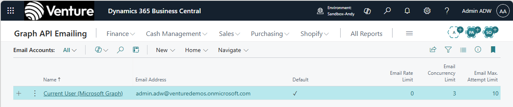
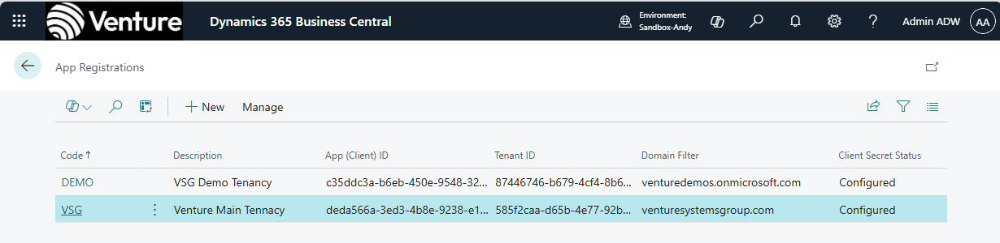

# D365BC-graph-api-email - Graph API Emailing

> **AI-Driven Proof of Concept**
> This project was written almost entirely by GitHub Copilot (Claude Sonnet), with direction and testing by [Andy Wingate](https://github.com/andywingate). Security review and code feedback by [Arend-Jan Kauffmann](https://github.com/ajkauffmann). It is a proof-of-concept. See [.github/instructions/](.github/instructions/) for the full AI context (coding standards and instructions) used throughout development.

An AL extension for Microsoft Dynamics 365 Business Central that lets every user - guest or member - send email from their own work address via the Microsoft Graph API (`Mail.Send`), with zero per-user configuration by admins.

## Dependencies

This extension has a hard dependency on **Rest Client OAuth** by Arend-Jan Kauffmann. Both apps must be installed in BC for this extension to function.

| **App** | **Publisher** | **Source** |
|---|---|---|
| Rest Client OAuth | AJ Kauffmann | [ajkauffmann/RestClientOAuth](https://github.com/ajkauffmann/RestClientOAuth) |

The `Rest Client OAuth` library provides the OAuth 2.0 Client Credentials flow, in-memory token handling (`SecretText` only, no persistent storage), and the `Rest Client` wrapper used for all Graph API calls. The dependency is declared in `app.json` and BC will require both PTEs to be deployed together.

## The Problem

Business Central's built-in email connectors do not work cleanly in multi-tenant scenarios:

- **"Current User"** (built-in) - works only for accounts native to the BC host tenant. Entra B2B guest users have a cross-tenant identity; BC cannot obtain a `Mail.Send` token for them using this connector.
- **Microsoft 365 / SMTP** - sends from a shared mailbox or service account, not from the individual user's own address. For guest users this means either email is not sent at all, or it arrives from a generic address that has no meaning to the recipient.

The result: guest users in BC either cannot send email, or their email arrives from the wrong address - causing confusion for customers, poor traceability, and broken workflows.

## The Solution

This extension implements the **"Current User" pattern** for Microsoft Graph - one logical account, every user sends as themselves.

A single email account called **Current User (Microsoft Graph)** is registered with BC's email framework. An admin sets it as the system default once and configures one or more Entra App Registrations (one per user home domain). After that, every send is fully automatic: the connector resolves the user's home domain from their BC identity at send time, selects the matching App Registration, and calls Graph using application-level (client credentials) authentication. No per-user consent flow, no token management per user, no admin action per send.

When any email is sent in BC - compose dialog, customer statements, scheduled reports, background jobs, ISV extensions - the connector decodes the current user's identity, routes to the correct App Registration, and calls `POST /v1.0/users/{email}/sendMail` using client credentials with the app's `Mail.Send` application permission (not delegated).

## Architecture

```
[BC Email Framework]
       |
       | default account set once
       v
[Current User (Microsoft Graph)]  <-- single fixed-GUID account
       |
       | resolve user home domain from Authentication Email
       v
[W365 App Registration]  <-- matched by Domain Filter (required, unique per registration)
       |
       | Client Credentials (app-only auth, in-memory token cache)
       v
[POST /v1.0/users/{email}/sendMail]  <-- sends as the user's home-tenancy identity
```

### Key components

| **Component** | **Purpose** |
|---|---|
| `Guest Email Connector` | Implements `Email Connector`, `Email Connector v4`, `Default Email Rate Limit`. `GetAccounts()` returns one fixed-GUID account. `Send()` resolves the user's home domain, selects the App Registration, and calls Graph using Client Credentials. All interactive paths build the OAuth stack fresh inside `[TryFunction]` - no `SingleInstance` codeunit in the call chain. |
| `App Registration` | Table storing one row per Entra app registration. Fields: Code (PK), Description, App ID, Tenant ID, Domain Filter, Redirect URI, Client Secret Status. Domain Filter is required and must be unique across registrations. Client secret stored in `IsolatedStorage` keyed by App ID (`DataScope::Company`). |
| `App Registrations` | List page. Entry point for admin setup - opened from the Email Account drill-in. |
| `App Registration Card` | Card page. Create or edit a single App Registration. Client secret is write-only (masked input, stored encrypted, never displayed). |
| `Graph Mail Mgt` | Calls `POST /v1.0/users/{email}/sendMail` and `GET /organization` (connection test). Builds the OAuth stack self-contained inside each `[TryFunction]`. |
| `Graph Session` | `SingleInstance` codeunit. Holds initialised `Rest Client` instances keyed by App Registration code for reuse across calls in one BC session. Used only outside `[TryFunction]` boundaries. |

### Auth model

- Authentication uses the **Client Credentials (app-only)** flow from AJ Kauffmann's `Rest Client OAuth` library. No browser popup, no user interaction, no per-user token storage.
- Tokens are held in memory by the `Rest Client` instance for the duration of the BC session (typically 1 hour). `W365 Graph Session` (SingleInstance) caches one `Rest Client` per App Registration so tokens are not re-acquired on every send.
- All interactive code paths (`Send()`, `TrySend()`, `TryPingGraph()`) build the OAuth stack fresh inside a `[TryFunction]` boundary and do not reference `W365 Graph Session`. This prevents the SingleInstance/TryFunction/collectible-error crash described in Lessons Learned.
- The `Home Email` field on `W365 User Email Token` caches the user's real home email decoded from their BC `Authentication Email`. It is used for the `From` display address in the Email Accounts page and compose dialog. No token data is stored there.
- The Entra app must have `Mail.Send` granted as an **application permission** with admin consent. Delegated permissions are not used for sending.

## Setup

See [QUICKSTART.md](QUICKSTART.md) for full step-by-step instructions. The short version:

1. Create one Entra app registration per user home domain, each with `Mail.Send` granted as an **application permission** with admin consent
2. Deploy this extension to BC
3. Open **Email Accounts**, find **Current User (Microsoft Graph)**, and click **Set as Default**
4. Open **App Registrations** from the account card and create one row per Entra app registration, including the Domain Filter (e.g. `contoso.com`) and client secret
5. Sending is immediate - no per-user action required

## Intended use

This extension is designed for BC environments where users belong to multiple home tenants - for example, a business that has invited users from another organisation as Entra B2B guests. It also works where all users share a single home tenant; one App Registration with the Domain Filter set to that tenant's domain covers that case.

### Mixed home-tenancy and B2B guest users

A typical scenario: a business runs BC in their own Entra tenancy (`contoso.onmicrosoft.com`). They also work closely with a supplier or partner organisation and have invited those users into BC as Entra B2B guests (signing in from `supplier.com`). Both groups are active BC users and both need to send email - customer correspondence, statements, notifications - from their own real email address, not from a generic shared account.

The setup is a one-time admin task: set **Current User (Microsoft Graph)** as the default email account, then create one App Registration for each home domain. At send time the connector reads the current user's BC identity, decodes their home domain, and routes automatically to the correct App Registration. Internal users send as `user@contoso.onmicrosoft.com`; B2B guests send as `user@supplier.com`. No routing flags, no per-user configuration, no admin action per user.



*A single account covers all users. BC resolves the correct sender identity at send time.*



*One App Registration per home domain. The Domain Filter on each registration determines which users it applies to. The connector selects the matching registration automatically based on the sending user's home email domain.*
`Mail.Send` only. Reply, inbox retrieval, and folder management are not implemented.

## Known limitations

- **`Mail.Send` application permission required** - the app registration must have `Mail.Send` granted as an application (not delegated) permission with admin consent in each home tenant's Azure portal. This means the registered app can technically send as any user in the tenant; it is the admin's responsibility to scope and audit this appropriately.
- **One Domain Filter per App Registration** - Domain Filter is required and must be unique. Each registration handles exactly one home domain. Environments where users have multiple email domains that map to the same Entra app registration are not directly modelled; create separate registrations for each domain.
- **Send-only** - Reply, inbox retrieval, and folder management are not implemented.

## Lessons Learned

### SingleInstance Codeunits and TryFunction - a critical AL constraint

The most significant technical lesson from this project: **`[TryFunction]` cannot reliably catch exceptions thrown from within, or triggered by, a `SingleInstance` codeunit**.

#### The flawed approach

The initial architecture used a `SingleInstance` codeunit (`W365 Graph Session`) to cache authenticated `Rest Client` instances per App Registration. The intent was to avoid re-acquiring a token on every send.

When called from a `[TryFunction]`, any exception thrown by the RestClientOAuth library - including the BC outbound HTTP consent dialog appearing mid-call - would bypass the try/catch and crash the entire BC session with "Something went wrong". This affected every interactive action: sending email, testing the connection, even deleting the account.

The key mistake: the RestClientOAuth library raises errors using `ErrorInfo.Create(message, true)` - the second parameter `true` marks the error as a **collectible error**. Collectible errors bypass `[TryFunction]` entirely, regardless of where the try boundary is placed. Combined with a `SingleInstance` codeunit in the call chain, the error had no way to be caught.

Repeated attempts to fix this by wrapping calls in `[TryFunction]` at different levels all failed. The session kept crashing on first use.

#### How it was diagnosed

A dedicated **Graph API Diagnostics page** (`W365 Graph Diagnostics`) was built to isolate each step of the send pipeline:

1. **Step 1** - resolve user identity and App Registration from the table directly (no codeunit calls)
2. **Step 2** - build the OAuth stack fresh and call `GET /organization` to prove token acquisition
3. **Step 3** - call `POST /users/{email}/sendMail` with a hardcoded JSON payload

Step 1 ran without error. Step 2 revealed a second issue: `IsolatedStorage.Get` was returning false because the App ID used as the storage key had been entered incorrectly during testing (a stray character). Once the client secret was re-entered, Step 2 returned HTTP 200 from Graph. Step 3 returned HTTP 202 - the send pipeline was proven end-to-end in the diagnostic page before a single line of the connector was changed.

#### The fix

All interactive code paths - `Send()`, `TryPingGraph()`, `TrySend()` - were rewritten to be **completely self-contained**: they build the OAuth stack from scratch inside the `[TryFunction]` boundary with no `SingleInstance` codeunit in the call chain at all.

```al
// WRONG - SingleInstance in the try boundary, collectible errors bypass the catch
[TryFunction]
local procedure TrySend(...)
var
    GraphSession: Codeunit "W365 Graph Session";  // SingleInstance
    Client: Codeunit "Rest Client";
begin
    GraphSession.GetRestClient(AppRegCode, Client);  // crash here is uncatchable
    GraphMailMgt.SendEmailMessage(...);
end;

// CORRECT - self-contained, no SingleInstance in the call chain
[TryFunction]
local procedure TrySend(...)
var
    AppReg: Record "W365 App Registration";
    OAuthClientApp: Codeunit "OAuth Client Application KFM";
    // ... all OAuth codeunits declared locally ...
    Client: Codeunit "Rest Client";
begin
    AppReg.Get(AppRegCode);
    AppReg.GetClientSecret(ClientSecret);
    // build OAuth stack fresh every call
    OAuthClientApp.SetClientId(AppReg."App ID");
    // ...
    Client.Initialize(HttpAuthentication);
    GraphMailMgt.SendEmailMessage(...);
end;
```

The `SingleInstance` codeunit is still present in the codebase for cases where it is safe to use (background jobs, non-interactive server-side calls), but it is never called from within a `[TryFunction]` or from any user-triggered action.

#### Rule of thumb

> **Never call a `SingleInstance` codeunit from within a `[TryFunction]`, and never call one from any user-triggered action where an exception from a dependency library could surface.**

If you need to cache something for performance, cache it in a non-SingleInstance codeunit and accept the per-request overhead during interactive operations. The BC session survival is more important than token cache efficiency.

---

## Acknowledgements

**Arend-Jan Kauffmann** ([ajkauffmann](https://github.com/ajkauffmann)) - security review, code feedback, and architecture guidance. AJ's review identified critical improvements around `SecretText`, `[NonDebuggable]`, `IsolatedStorage` encryption, token lifecycle, and adoption of System Application modules. These are tracked in Phase 3a of the project plan.

OAuth flow architecture patterns were informed by AJ's reference implementation: [ajkauffmann/RestClientOAuth](https://github.com/ajkauffmann/RestClientOAuth).
